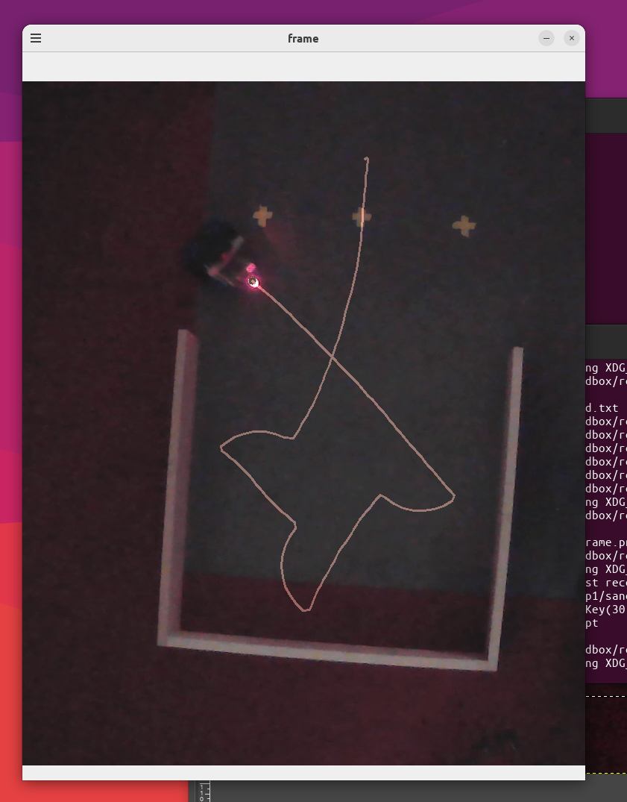

# robotracker



run with for example:

```
python optical_flow.py vids/culdesacA2
```

Press <Esc> to stop the tracking.

It writes out:

 - 1st image of the track (culdesacA2_1stframe.png)
 - the tracking coordinates (culdesacA2_coord.txt)
 - the trace as an image (culdesacA2_trace.png)

